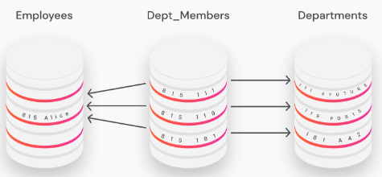

# Dgraph简介

Dgraph是一种图数据库，图数据库不同于关系型数据库（Mysql）/非关系型数据库（Redis）。在图数据库中，数据以节点、边、面的形式存储，而边可以将节点进行关联，进而形成一种“图结构”。

目前中文文档不是很多，dgraph官方地址如下

> https://dgraph.io

对于传统关系数据库来说，其使用表格的形式来存储数据，（如下图）每一列代表一个表，表与表之间的箭头代表着关系。



在关系数据库中，数据是由行和列组成的表格来表示，每个表通常代表一个特定的实体。要想表示实体之间的联系（也就是在表之间创建关系）有两种方法：一种方法是一个实体通过主键直接引用另一个实体，对于多对多的关系来说，该方法并不适用；第二种方法可以通过建立一个特殊的表来存储表与表之间的关系。

相对比来说，图数据库可以以更自然的方式进行建模，图数据库中的关系和数据一起存储，在查询高度关联的数据时性能更好。

# Dgraph特点

Dgraph是一种原生Graph数据库，支持原生GraphQL。开源、可扩展、分布式、高可用...

- 分布式：首次构建即具有分布式，以处理更大的数据集
- 支持GraphQL
- 事务以及ACID特性（原子性、一致性、隔离性、持久性）
- 支持多种语言
- 支持全文搜索、模糊搜索等
- 可以查询地理坐标数据

# 节点、关系、值

Dgraph主要用来存储节点、节点之间的关系、以及关系的相关属性。

Dgraph支持RDF/JSON进行数据操作。

例如：

小明有个朋友叫小亮，小明的属性有年龄、性别，小亮的属性有年龄、性别、身高。

那么在Dgraph中，这种关系就可以用如下JSON来表示：

```json
{
"name":"小明",
"age":12,
"friends":{
	"name":"小亮",
	"age":10,
	"height":160
}
}
```

这里的“friends”就把小明和小亮关联了起来。

Dgraph同样支持索引来加快查询速度，而不同的查询条件也需要采用不同的索引，一般会先在schema中定好自己要查询的节点类型、索引类型等。

